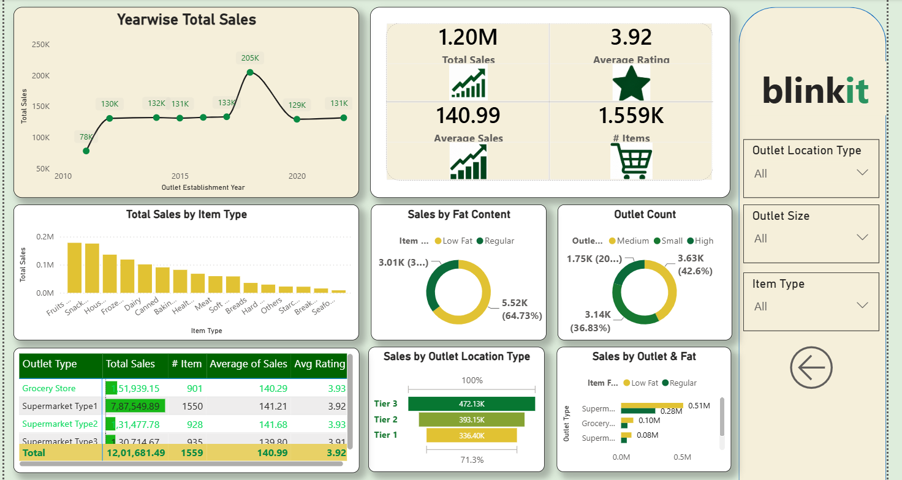

 # Blinkit Grocery Sales Dashboard – Power BI

## 📊 Project Overview

An interactive Power BI dashboard developed to analyze Blinkit grocery sales data and generate meaningful business insights.

The dashboard provides an overview of sales performance, item categories, outlet characteristics, customer ratings, and outlet-level analysis through interactive visualizations.

## 🛠️ Tools & Technologies

- Microsoft Power BI
- Power Query
- DAX
- Data Cleaning & Transformation
- Data Analysis
- Data Visualization

## 📈 Dashboard Features

- Total Sales Analysis
- Average Sales
- Average Rating
- Total Items
- Sales by Item Type
- Sales by Fat Content
- Sales by Outlet Size
- Sales by Outlet Location
- Sales by Outlet Establishment Year
- Outlet Performance Analysis
- Interactive Filters and Visualizations

## 🔍 Key Insights

- Analyzed overall sales performance across different outlet types and locations.
- Compared sales across different product categories.
- Examined the impact of outlet size and establishment year on sales.
- Analyzed customer ratings and item-level performance.
- Used interactive filters to explore the data from different perspectives.

## 📷 Dashboard Preview

 ## 📷 Dashboard Preview

## 🎯 Skills Demonstrated

- Data Cleaning
- Data Transformation
- Data Analysis
- Data Visualization
- Power Query
- DAX
- Power BI Dashboard Development
- Business Intelligence

## 📁 Project Files

- `BlinkIT_Grocery_Dashboard.pbix` – Power BI dashboard file
- `BlinkIT_Dashboard.png` – Dashboard preview
- `BlinkIT-Grocery-Data.csv` – Dataset used for analysis

## 👨‍💻 Project Purpose

This project was created as part of my Data Analytics learning journey to practice data cleaning, transformation, analysis, visualization, and interactive dashboard development using Power BI.
